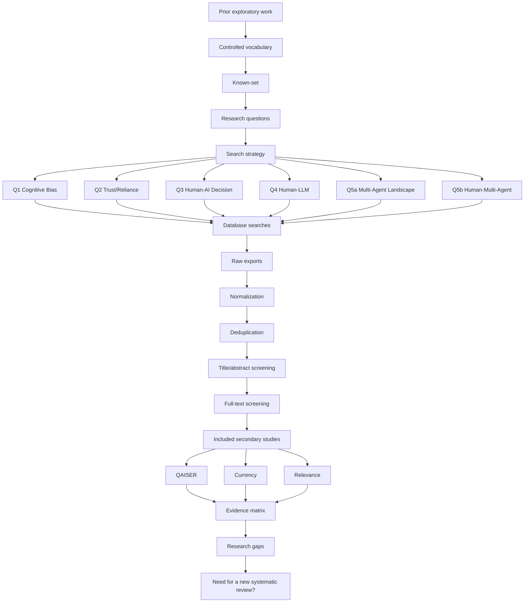

# Research Process

## Princípios de processo

1. **Reprodutibilidade:** cada busca deve registrar base, versão da query, data, filtros e número de resultados.
2. **Proveniência:** arquivos brutos não são editados.
3. **Rastreabilidade:** cada estudo deve poder ser rastreado até sua base e query de origem.
4. **Controle de decisões:** mudanças metodológicas são registradas no decision log.
5. **Separação entre descoberta e evidência:** mappers anteriores, OpenAlex e ferramentas de IA servem como fontes exploratórias/auxiliares, não como corpus automaticamente incluído.
6. **Humano como sujeito cognitivo:** não atribuir cognição humana literal ao LLM.
7. **Known-set não é corpus:** estudos conhecidos validam busca; entram no corpus apenas se passarem pelos mesmos critérios de elegibilidade.

